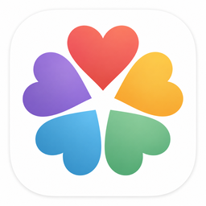

<p align="center">
  
</p>

# ❤️ Love Dialects

**Love Dialects** is a simple, private, browser-based family tool designed to help people move from knowing a general love language to understanding the **specific ways love tends to land best**.

It is built as a single HTML file and can be hosted easily with **GitHub Pages**.

The app is designed especially for couples and families with young children who want something practical, simple, and easy to use on a phone.

---

## What is a "Love Dialect"?

A love language is a broad category.

A **love dialect** is a more specific expression inside that category.

For example:

- **Acts of Service**
  - Notice What Needs Doing
  - Lighten My Load
  - Step In for Me
  - Prepare for Me
  - Take Care of Me
  - Fix It With Me
  - Teach/Help Me Do It

Or:

- **Physical Touch**
  - Tenderness
  - Everyday Affection
  - Hold Me
  - Comfort Me
  - Be Beside Me
  - Physical Play
  - Romantic / Intimate Touch

The goal is not simply to say:

> "My love language is Acts of Service."

The goal is to discover something more useful, such as:

> "I especially feel loved when someone notices what needs to be done and helps without making me coordinate everything."

---

## Main Features

### ❤️ Love Someone

The main screen is designed around action rather than testing.

Choose:

- Wife
- Husband
- Any child profile

Then choose how much time or energy you have:

- 🪫 **20 seconds**
- 🙂 **5 minutes**
- 💪 **15+ minutes**

The app suggests one practical expression of love based on that person's saved profile.

---

## Adult Love Dialect Finders

Love Dialects does **not** attempt to determine your primary love language.

Instead, you select the love language you already know you want to explore:

- 💬 Words of Affirmation
- ⏱️ Quality Time
- 🎁 Receiving Gifts
- 🛠️ Acts of Service
- 🤗 Physical Touch

Each finder presents simple comparisons:

> Which would feel more loving?

You can choose:

- A feels more loving
- About equal
- B feels more loving

The results rank the different dialects inside that love language.

---

## Children's "Love Clues"

Children are not given permanent love-language labels.

Instead, parents can periodically observe **Love Clues** such as:

- **See Me**
- **Hear Me**
- **Enjoy Me**
- **Help Me**
- **Hold Me**
- **Guide Me**

These are meant to describe what a child seems especially responsive to **right now**, while recognizing that children are still developing.

---

## Dynamic Family Profiles

The app is not limited to one specific family size.

You can:

- Add children
- Remove children
- Rename children
- Assign colors to child profiles
- Keep separate Love Clues and Favorites for each child

The included starter configuration uses three child profiles, but families can customize this.

---

## ❤️ Favorites

When an expression works especially well, save it as a Favorite.

Favorites stay attached to that person's profile so useful ideas are easy to find again.

---

## "How to Love Me" Cards

Each profile can generate a simple summary based on its strongest dialects or Love Clues.

These cards are designed to answer:

> "What tends to make this person feel especially loved?"

They can be used as a quick personal reference or shared with a spouse.

---

## Reevaluation Reminders

Preferences can change with age, stress, responsibilities, and seasons of life.

The app includes gentle check-in reminders:

- **Adults:** approximately every 6 months
- **Children:** approximately every 3 months

Instead of treating a profile as permanently fixed, the app asks whether the current results still seem accurate.

---

## Privacy

Love Dialects is intentionally designed without a server or user account system.

Family data is stored locally in the browser using `localStorage`.

That means:

- No database is required
- No login is required
- No family profile data is sent to a server by the app
- GitHub Pages only hosts the application files
- Each browser/device keeps its own copy of the family data

### Important

Clearing browser/site data may erase saved profiles.

Data also does **not automatically sync between devices**.

Use the built-in backup feature if the information matters to you.

---

## Backup and Restore

The app can export family data as a JSON backup file.

Use this to:

- Keep a backup
- Move your profiles to another device
- Restore your data after clearing browser storage

The Import feature validates the backup before replacing the current local data.

---

## Installation

There is no build process.

The entire app can run from a single file:

```text
index.html
```

### Run Locally

Download `index.html` and open it in a modern browser.

---

## Publish with GitHub Pages

1. Create a new GitHub repository.
2. Upload `index.html` to the root of the repository.
3. Open the repository's **Settings**.
4. Select **Pages**.
5. Under **Build and deployment**, choose:
   - **Deploy from a branch**
6. Select your main branch and the root `/` folder.
7. Save.
8. GitHub will provide the public Pages address.

No backend, database, package installation, or build command is required.

---

## Technical Details

Love Dialects is intentionally lightweight.

It uses:

- HTML
- CSS
- Vanilla JavaScript
- Browser `localStorage`
- JSON export/import

It does **not** require:

- React
- Node.js
- npm
- A database
- A web server beyond static hosting
- External JavaScript libraries

This makes it easy to inspect, modify, fork, and host.

---

## Design Philosophy

The application is built around a few principles:

### Don't measure love. Practice it.

This is not intended to become a relationship scorecard.

### Preferences are clues, not demands.

A high-ranking dialect does not mean a spouse must express love only that way.

### Children should not be placed in permanent boxes.

Love Clues are intentionally temporary and developmental.

### Love is both choice and expression.

Commitment matters, but people also benefit from affection, attention, service, presence, encouragement, and tenderness.

### Keep it practical.

The app should help answer:

> "Given this person, this moment, and the energy I actually have, what is one good way I can move toward them?"

---

## Intended Use

Love Dialects is meant as a personal relationship and family reflection tool.

It is **not**:

- Marriage counseling
- Mental health treatment
- A psychological assessment
- A diagnostic instrument
- A substitute for professional family or relationship support

---

## About the Love Languages Concept

This project was inspired by the general concept of the **Five Love Languages**, associated with Gary Chapman.

Love Dialects is an independent project and is **not affiliated with, endorsed by, sponsored by, or an official product of Gary Chapman, The 5 Love Languages, Moody Publishers, or Love Nudge**.

The dialect categories, Love Clues system, questionnaires, wording, scoring approach, and application design in this project are independently developed for this tool.

---

## Current Status

This project is currently a lightweight family-focused web app.

Possible future improvements include:

- More personalized expression suggestions
- Optional "This Worked" feedback
- Better print/share layouts
- Installable Progressive Web App (PWA) support
- Additional accessibility improvements
- Optional device-to-device transfer improvements

---

## Contributing

If you fork or modify the project, contributions that preserve the project's goals are welcome:

- Keep the interface simple
- Protect user privacy
- Avoid turning the app into a relationship scorecard
- Keep children's results developmental rather than diagnostic
- Favor practical expressions over abstract advice

---

## License

This project is released under the **MIT License**.

You are free to use, copy, modify, merge, publish, distribute, sublicense, and/or sell copies of the software, provided that the copyright and license notice are included.

See [`LICENSE`](LICENSE) for the full license text.

---

## Core Reminder

> **Don't measure love. Practice it.**
